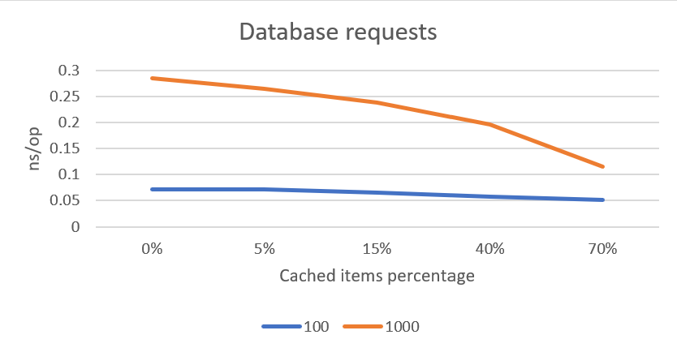
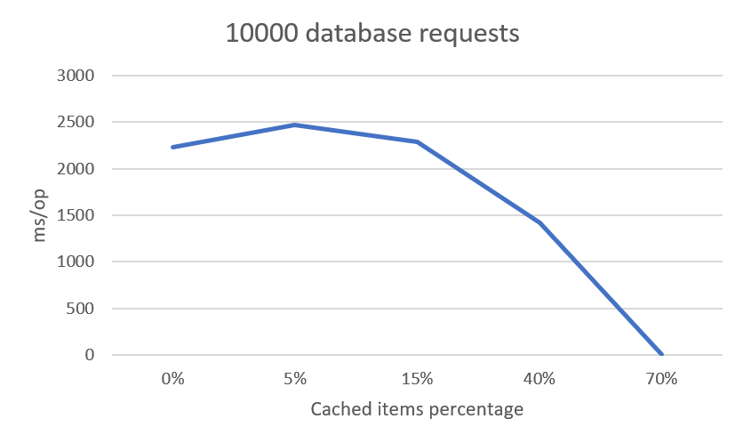
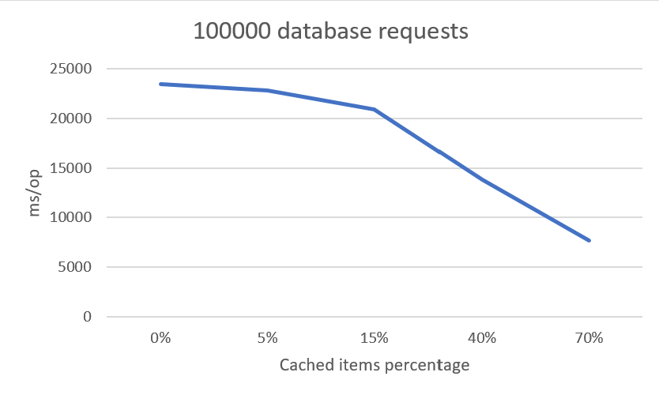

# Badger POC

The purpose of this repository is to study and achieve an ideal strategy for accessing data in multiple repositories, for now, one will be for caching, and the other will the source-of-truth such as a database. The database access will be mocked, with just a parametrized delay. 

Another objective of the code implemented, is to test and compare how an application will perform by applying an in-memory cache layer over the database access, tweaking the amount of access, the cache size, and the mocked database access average delay.

Using [Badger](https://github.com/dgraph-io/badger) for in-memory cache, [GORM](https://gorm.io/) for database integration, and Go's standard lib for everything else.

# Results

Make sure to check the [project's journal](https://github.com/pedrohff/badger-poc/blob/master/JOURNAL.md) to see how it is being developed and how I organized my ideas for it.

When using a small amount of requests, the cache layer did not show a lot of improvement, still there were some. On the first two cases, triggering 100 and 1000 requests per test, Golang's benchmark tool could repeat each of them 1000000000 times to check an average of each operation, and these were the results obtained:

As I controlled the percentage of items cached, the first test went from 0.072ns/op with no cache to 0.052ns/op caching 70% of results; following the same logic, with 1000 requests, the results went from 0.285ns/op to 0.115ns/op.

The result of the following tests presented a huge gap on the time of each operation, so they will be displayed separately.

This particular scenario is quite odd. First we have to notice the results went from ns/op to ms/op, as the number of requests increased a lot. The benchmark tool could only run each test once, still I ran it multiple times, and the results were similar. The results started with each operation costing 2232*ms*, descending drastically to 700*ns* following the same logic as the ones above, from 0% to 70%.

For the last scenario, it behaved a little like the one with 10000 requests per tests, but the numbers went down accordingly.

The results went from 23428ms/op to 13825/op.

To sum up, the cache layer should be helpful as expected. The main result of this experiment was the knowledge obtained regarding Golang's benchmark tool and the caching tool (Badger). As a side note, writing as I code was an important part of it all, I should practice it more often.

Suggestions to improve the code is always appreciated! I feel like the structure of the repository-related is still in progress, hope to update it soon.